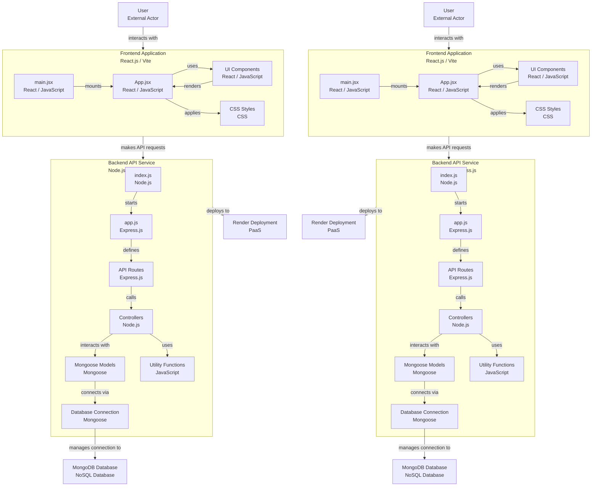

# XYZCode94 College HELPDESK

A full-stack web application built to help manage college applicant data and resources. It uses React + Vite for the frontend and Node.js + Express + MongoDB for the backend.

## Live Links
Frontend: [https://your-frontend-url.vercel.app](https://your-frontend-url.vercel.app)  
Backend: [https://your-backend-url.onrender.com](https://your-backend-url.onrender.com)  
*Replace with actual deployed URLs.*

## Project Structure
xyzcode94-collage_helpdesk/  
├── README.md  
├── Backend/  
│   ├── package.json  
│   ├── render.yaml  
│   └── src/  
│       ├── app.js  
│       ├── constants.js  
│       ├── index.js  
│       ├── controllers/track.js  
│       ├── db/index.js  
│       ├── models/track.model.js  
│       ├── routes/track.route.js  
│       └── utils/ApiError.js, ApiResponse.js, asyncHandler.js  
└── Frontend/  
    ├── README.md  
    ├── eslint.config.js  
    ├── index.html  
    ├── package.json  
    ├── vercel.json  
    ├── vite.config.js  
    └── src/  
        ├── App.css, App.jsx, index.css, main.jsx  
        └── assets/  
            ├── components: admission.jsx, department.jsx, footer.jsx, landing.jsx, navbar.jsx, NewApplicants.jsx, resources.jsx, scroll.jsx  
            └── css: adm.css, departments.css, resources.css, style.css

---

---

## Run Locally
Backend:  
cd Backend  
npm install  
npm start  
→ http://localhost:5000  

Frontend:  
cd Frontend  
npm install  
npm run dev  
→ http://localhost:5173

## Push to GitHub
git init  
git remote add origin https://github.com/your-username/xyzcode94-collage_helpdesk.git  
git add .  
git commit -m "Initial commit"  
git branch -M main  
git push -u origin main

## Stack
Frontend: React, Vite, CSS  
Backend: Node.js, Express, MongoDB  
Deployment: Vercel (Frontend), Render (Backend)

## License
MIT

## Author
GitHub: [https://github.com/xyzcode94](https://github.com/xyzcode94)
